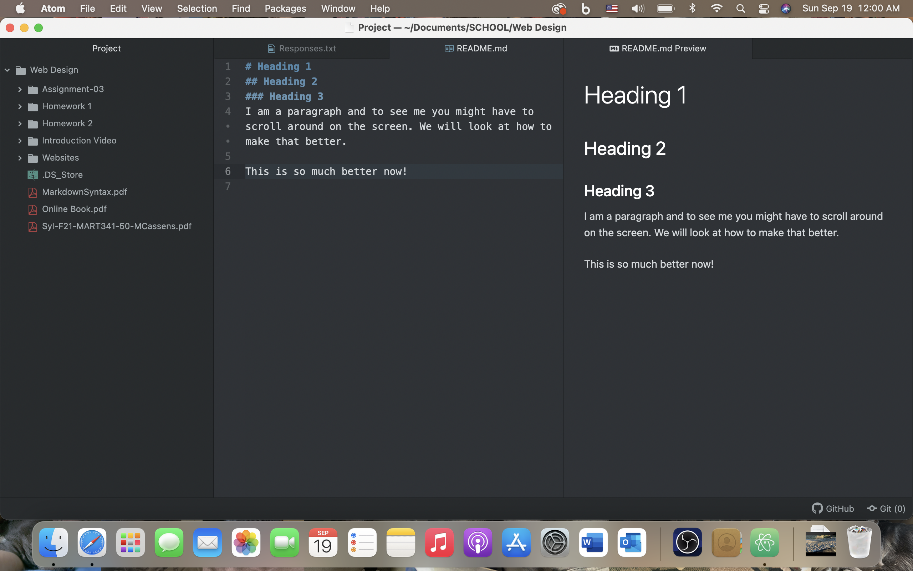

# Assignment 3
## Courtney Wiest

Three things I have learned so far:
1. A website's domain name and IP address are linked, enabling the website to be accessed through the domain name. 
2. Web directories are organized like file systems on a computer are organized. 
3. Cookies are placed on a user's computer by a web browser in order to store information that the user needs, for example, items in a shopping cart. 

# Heading 1
## Heading 2
### Heading 3
I am a paragraph and to see me you might have to scroll around on the screen. We will look at how to make that better.

This is so much better now!

[Course Website](https://montana-media-arts.github.io/341-web-design-Fall2021//)

[My Responses](./Responses.txt)

