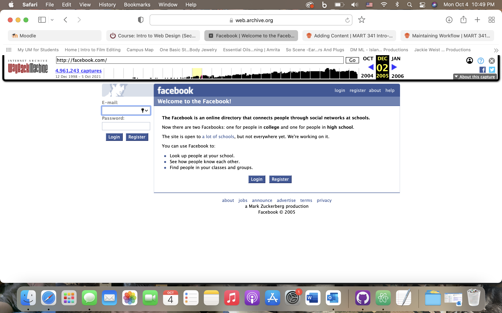

I chose to visit facebook.com from December 2, 2005. The login screen was really outdated. There are links at the bottom of the page including about, jobs, announce, advertise, terms, and privacy. There is also a box with a little description of what facebook is and what it does. None of these are included on the current site.
I really liked these last few topics. Dealing with and typing out the code has been a little challenging because it has to be exactly right or it won't work, but it feels kind of like a puzzle and it's kind of fun. I was able to continue to mess with what I was doing/working with until I eventually figured everything out.

