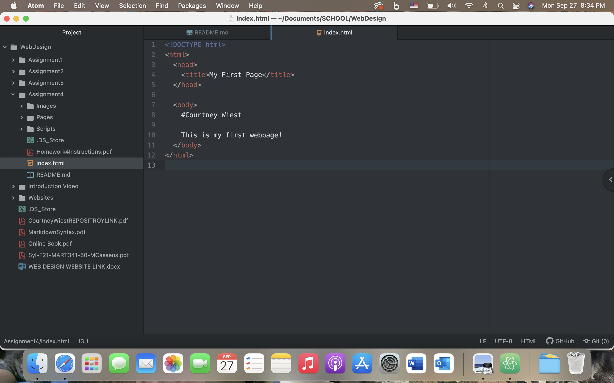

A browser is a software application that retrieves and displays web resources that you choose. The browser contacts the server and requests information on how to properly display the results on the user's computer. The only browser I use for the web is Safari.

Markup language is a text-encoding system that consists of symbols and text in a document that determines its structure, formatting, and the relationship between its parts. HTML is one of the most commonly used markup languages used in development.

